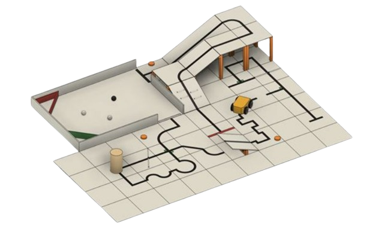
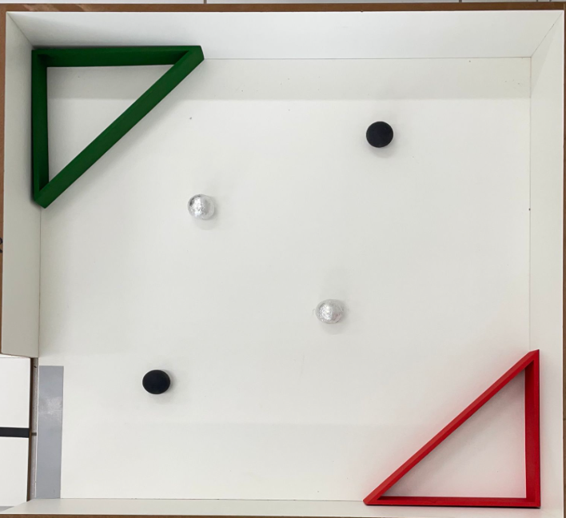
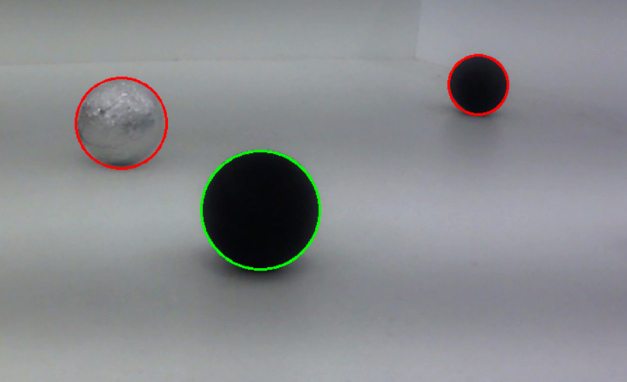
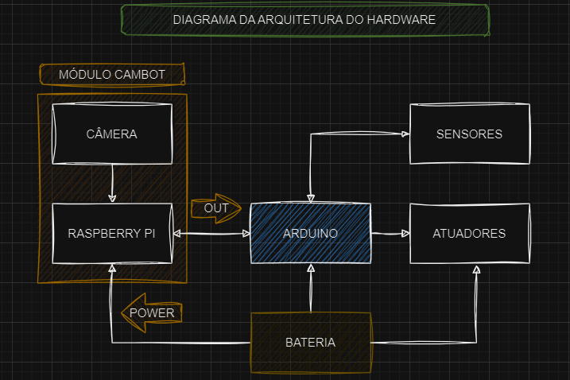
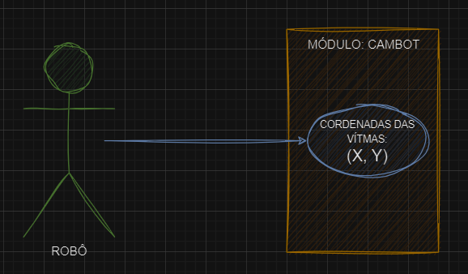

+++
title = "My presentation"
outputs = ["Reveal"]
+++

# 📷🤖
# CAMBOT
###### Módulo de identificação de vítimas para a Olimpíada Brasileira de Robótica.

---

# INTRODUÇÃO

- Robótica no Brasil;
- Olimpíada Brasileira de Robótica;

---
# INTRODUÇÃO
- Manual de regras;
- Sala de resgate;

---
# INTRODUÇÃO
- Estratégias já existentes;
- Módulo de visão computacional

---
# PROBLEMÁTICA
- Falhas na detecção das estratégias existentes;
- Melhorar os resultados.

---
# OBJETIVOS
- Compreender e utilizar algoritmos de visão computacional;
- Adaptar e calibrar algoritmos;
- Desenvolver o software para o robô;
- Enviar dados de coordenadas ao Arduino.

---
# METODOLOGIA

- Estudo e testes das tecnologias a serem utilizadas.

---
# METODOLOGIA

- Desenvolver os algoritmos para testes com imagens e vídeos.

--- 
# METODOLOGIA

- Estabelecer uma conexão para o módulo e o robô.

---
# METODOLOGIA

- Enviar dados de coordenadas ao Arduino.

---
## DISCIPLINAS INTEGRADAS

- Fundamentos de lógica e algoritmos;
- Programação estruturada e orientada ao objeto;
- Eletricidade instrumental;
- Eletronica analógica e digital;
- Organização e manutenção de computadores.

---
# CRONOGRAMA

---
## CONSIDERAÇÕES FINAIS

